# TOEIC with Allen

> Welcome to the TOEIC Study Platform — a smart, interactive web application built using Spring Java and integrated with Allen AI. 
> This platform helps users prepare for the TOEIC exam through AI-driven question generation, real-time feedback, and collaborative learning features.

---

## 🚀 Key Features

- 🤖 **AI-Powered Feedback** – Get explanations, corrections, suggestions, and examples using Allen AI
- 🎧 **TOEIC Listening Quizzes** – Practice real-style TOEIC listening questions with audio
- 📖 **TOEIC Reading Quizzes** – Test comprehension with grammar, vocabulary, and reading passages
- 📝 **Note-Taking** – Users can write and manage personal study notes
- 💬 **User-to-User Chat** – Interact and study collaboratively with other learners
- 🌟 **Platform Review System** – Leave feedback of the platform 
- 📬 **Contact Admin Form** – Send questions or support requests to the platform owner
- 🔒 **Secure Auth System** – Login with Google Oauth2, register, and manage user profiles

---

## 🛠️ Tech Stack

| Layer                | Technology                                                                                     |
|----------------------|------------------------------------------------------------------------------------------------|
| **Backend**          | Spring Boot, Spring Security, Spring Scheduler, JPA, MyBatis, Lombok, RESTful API architecture |
| **Frontend**         | Thymeleaf, Bootstrap, HTML, CSS, JavaScript, Quill.js, lottie.min.js                           |
| **API**              | RESTful API architecture, JSON responses                                                       |
| **Integrations**     | Allen AI API, OAuth2 (Google Login), Long Polling                                              |
| **Database**         | MySQL                                                                                          |
| **DevOps / Infra**   | AWS EC2, Gradle                                                                                |
| **UI/UX Design**     | Figma                                                                                          |
| **DB Design**        | ERD Cloud                                                                                      |

---

## 👥 Team Members

| Name      | GitHub                                        |
|-----------|-----------------------------------------------|
| 노영재     | [NohYeongJae](https://github.com/NohYeongJae) |
| 박정현     | [jdoitja](https://github.com/jdoitja)         |
| Elini Ng  | [elini-ng](https://github.com/elini-ng)       |

---

## 📂 Project Structure
```
├── src/
│ ├── main/
│ │ ├── java/com/estsoft/project3/
│ │ │ ├── configuration/ # Config classes
│ │ │ ├── contact/ # Contact form logic
│ │ │ ├── controller/ # REST & MVC controllers
│ │ │ ├── domain/ # Entity and domain models
│ │ │ ├── dto/ # Data Transfer Objects
│ │ │ ├── file/ # File handling (e.g. uploads)
│ │ │ ├── handler/ # Exception handling, interceptors
│ │ │ ├── repository/ # JPA repositories
│ │ │ ├── review/ # Review feature logic
│ │ │ └── service/ # Business logic layer
│ │ └── resources/
│ │ ├── static/
│ │ │ ├── css/
│ │ │ ├── images/
│ │ │ └── js/
│ │ └── templates/ # Thymeleaf HTML files
│ └── test/ # Unit and integration tests
├── screenshots/ # README screenshots
└── README.md
```

---

## 📸 Screenshots

### 🏠 Main Page


### 💡 Grammar Help
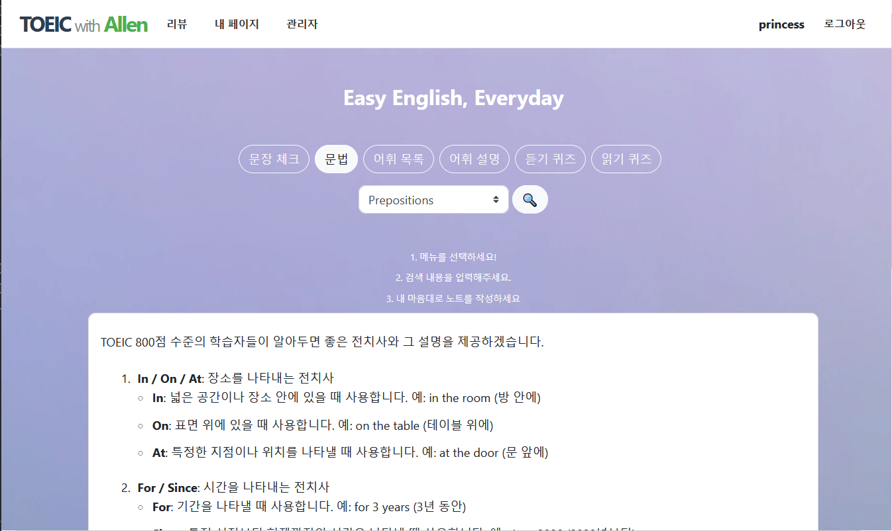

### 🎧 TOEIC Listening Quiz
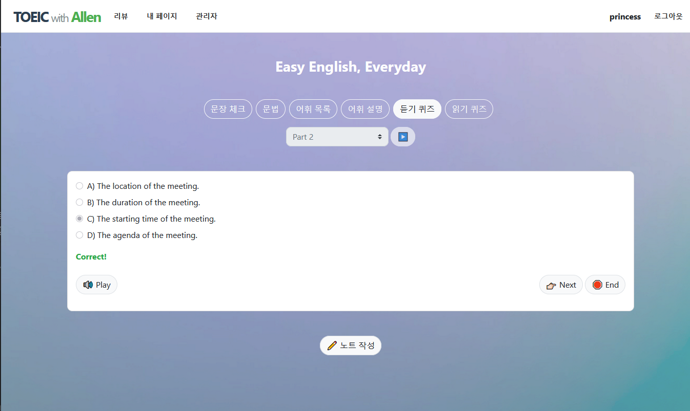

### 📖 TOEIC Reading Quiz
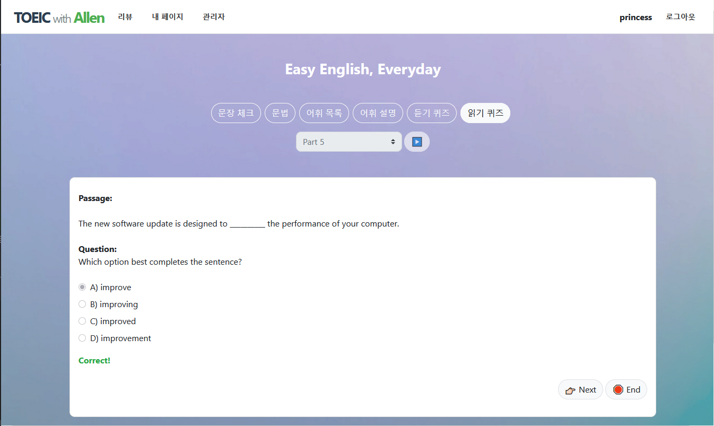

### 🔐 Login
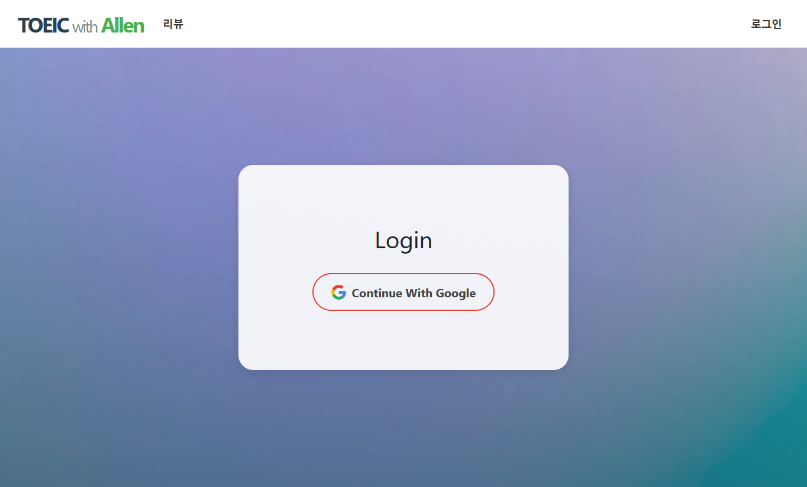

### 🧑‍💼 Sign Up – Set Nickname
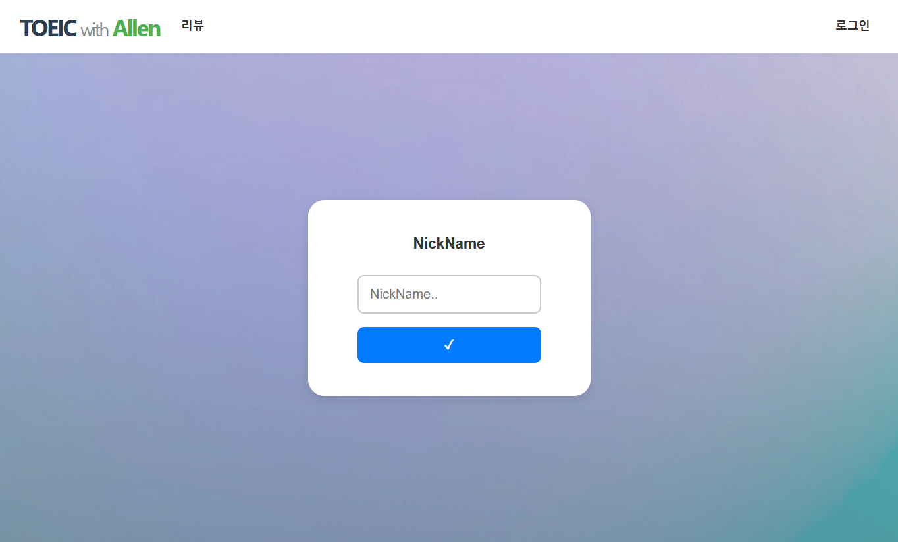

### 🌟 Platform Review Page
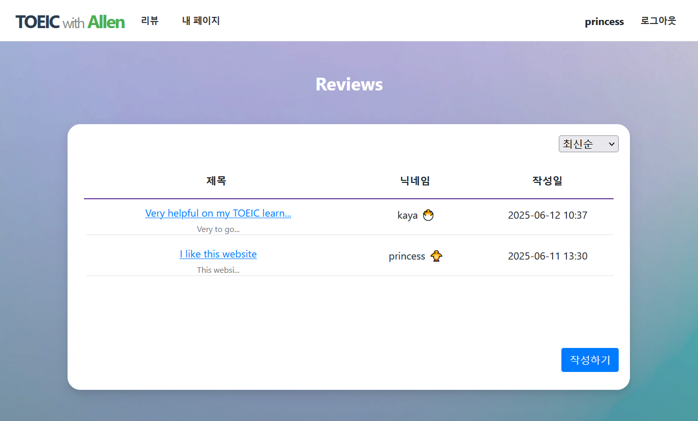

### 🛠️ Admin Dashboard
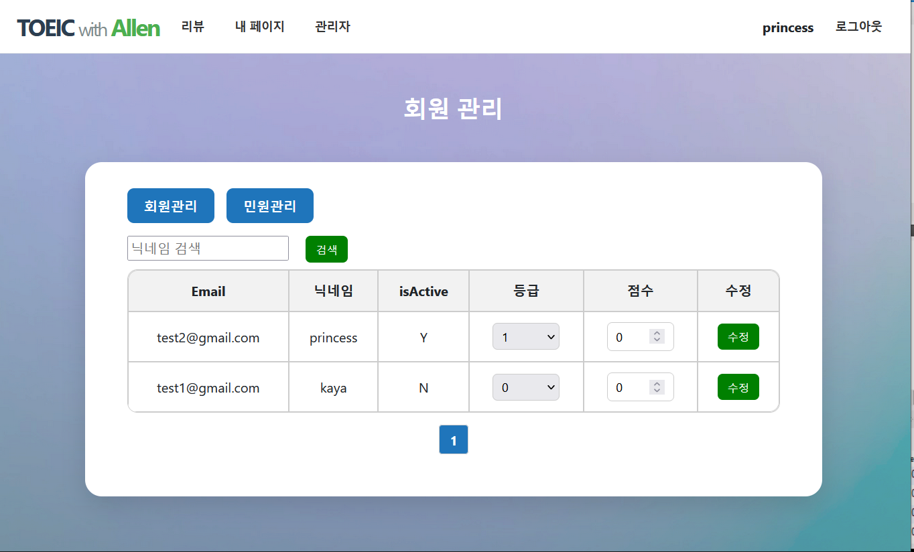

### 🙋 My Page – Overview
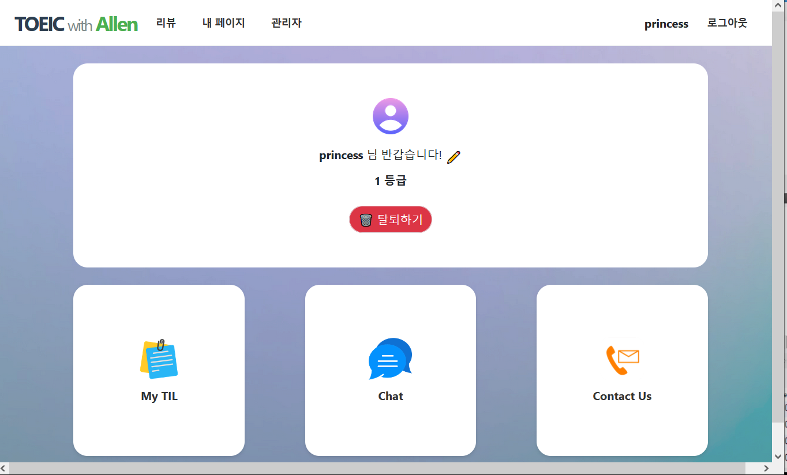

### 📘 My Page – Today I Learned
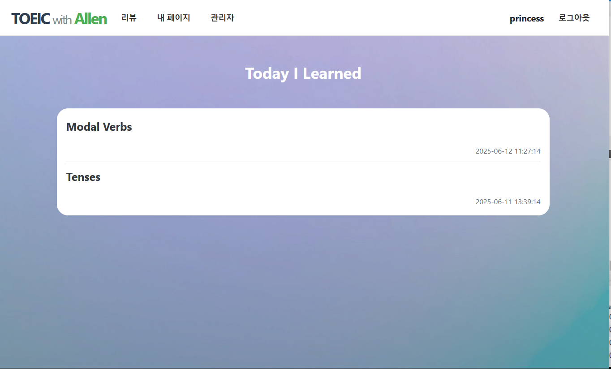

### 💬 My Page – Chat
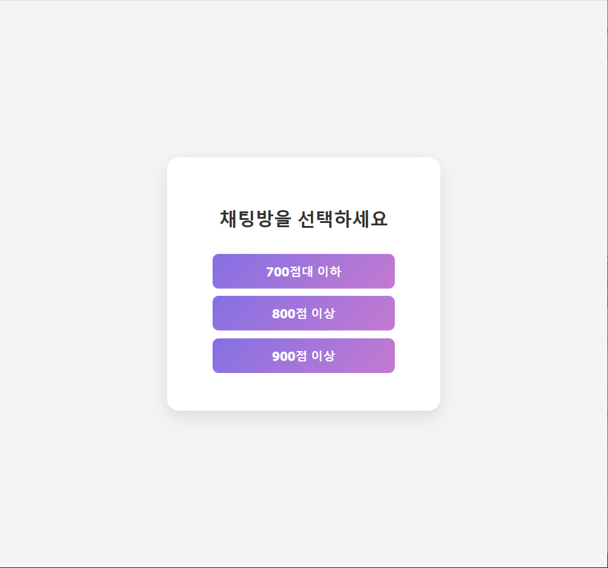

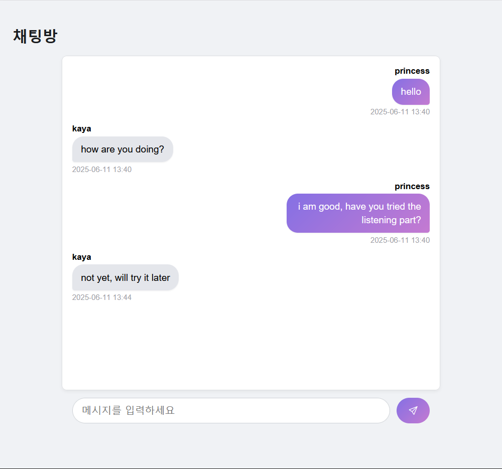

### 📬 My Page – Contact
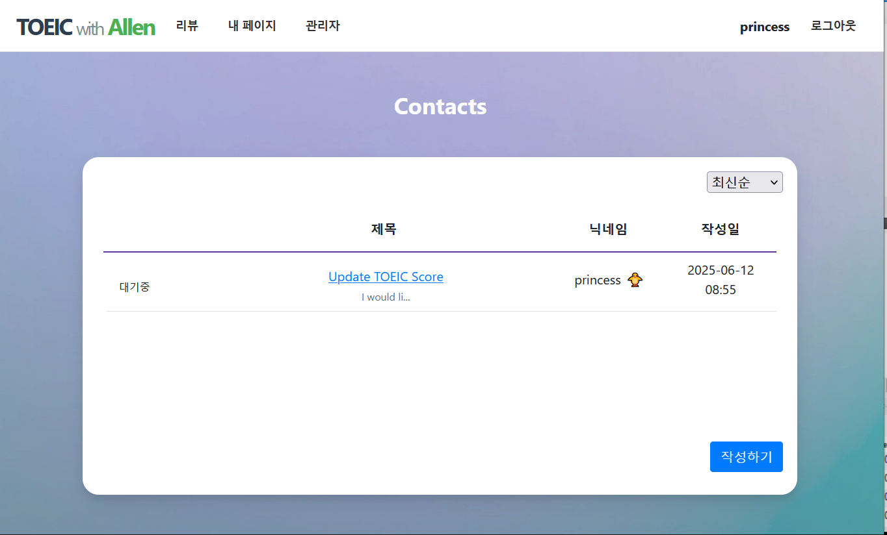

